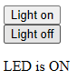
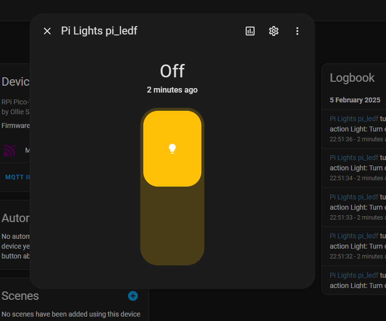

# Py Lights Project - Ollie Saunders
## Introduction
For my skills section of DofE, I have decided to spend 3 months learning Python, and my dad suggested using a Raspberyy Pi Pico to run VSCode

[Raspberry Pi Pico](https://www.raspberrypi.com/documentation/microcontrollers/pico-series.html)

The final aim is to make something to individually control LED and RGB Lights.

## Week 1 - 5/11/24

* We prepared VSCode to use as the editor.
* We also setup the Raspberry Pi Pico to run on VSCode by installing the required plugins/extensions.
* Additionally we linked setup a Github repository to store the code.
* We also copied a code to blink the LED to test the code was working

## Week 2 - 12/11/24

* We worked out how to control the Pico wirelessly using a website
* This involved using html to make a simple web page
* Also, I set up a hidden file to store Wi-Fi information, so they were not visible on Github

## Week 3 - 3/12/24

* I spent more time than usual as I missed a week
* I researched ideas for projects for the Raspberry Pi Pico w
* I also spent some time looking into the basics of how to use MQTT

[MQTT Basics Website](https://www.hivemq.com/blog/how-to-get-started-with-mqtt/)

* Here is my protocol design for MQTT:

~~~
light/state [on/off]        # current state of light (publish)
light/switch [on/off]       # turn light on or off  (subscribe)
~~~

* I took an MQTT micropython client from Github

[UMQTT Micropython library](https://github.com/micropython/micropython-lib/blob/master/micropython/umqtt.simple/umqtt/simple.py)

* Using this client I adapted my code to use the protocol above to control the LED on the Raspberry Pi Pico W
* Command line instructions to control the LED:
~~~
mosquitto_pub -h localhost -t light/switch -m "on"
mosquitto_pub -h localhost -t light/switch -m "off"
~~~

## Week 4 - 4/1/25

* I spent several hours this week working on the python project
* I spent some time at the start looking into home assistant's MQTT protocol

[Home assistant MQTT](https://www.home-assistant.io/integrations/mqtt)

* I moved part of the code from main to a seperate file containing a python class (ha_mqtt_light)
* After some debugging using mosquito_sub, we managed to publish a config topic to home assistant, so it discovered my light
* This let me control the light remotley on the board from Homeassistant

## Week 5 - 30/1/25

* I did some research on individually adressable RGB LEDs; I used this video to compare between different options;
[Youtube Video](https://www.youtube.com/watch?v=QnvircC22hU)
* I chose and ordered the sk6812 LED strip as it was RGBW where other options were only RGB
* Once it had arrived I had to solder the power supply connector to the light strip, and a connector to the Pico board to plug into the LED strip
* Later I used the neopixel library from GitHub to control and test the lights;
[Neopixel GitHub Repository](https://github.com/blaz-r/pi_pico_neopixel)

## Week 6 - 5/2/25

* This week we got the LED strip to be controlled from homeassistant using MQTT
* This took a lot of debugging because Homeassistant had very strict rules on format
* We managed to get it working as a basic on/off switch;
next we want to be able to control colours without editing the code

